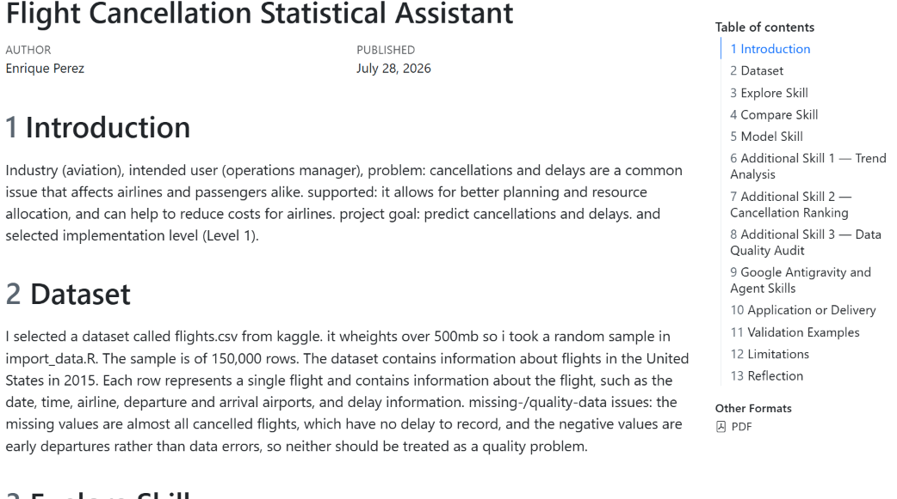

# Flight Cancellation Statistical Assistant

An Industry Statistical Assistant that helps an airline operations manager
understand flight delays and cancellation risk, then decide which flights and
route profiles need proactive contingency planning.

- **Student name:** Enrique Perez
- **Selected implementation level:** Level 1 — Quarto Statistical Report
- **Industry:** Aviation / Air travel
- **Intended user:** Airline operations manager
- **Problem:** The manager needs to understand delays and identify flights at
  high risk of cancellation.
- **Decision supported:** Which flights/routes should receive proactive planning
  (crew, rebooking capacity, passenger communication).

## Dataset
- **Source:** Kaggle "2015 Flight Delays and Cancellations" (US DOT / BTS)
- **Unit of observation:** one scheduled US domestic flight in 2015
- **Size:** ~5.8M rows (sampled to 150,000 for speed; see `data/README.md`)
- **Outcome:** `cancelled` (1 = cancelled, 0 = operated); ~1.5% cancelled
- See [`data/README.md`](data/README.md) for access instructions.

## The Six Skills

| Skill | User Question | Method | Main Output | Decision Supported |
|---|---|---|---|---|
| Explore | What do departure delays look like? | Descriptive stats + histogram | Summary table, histogram | Understand delay baseline |
| Compare | Do weekend flights differ from weekday? | Welch's t-test | Group means, difference, 95% CI, p | Scheduling/staffing |
| Model | Which flights are likely to cancel? | Logistic regression | Coefficients + AUC/recall | Proactive contingency planning |
| Trend Analysis | How did cancellations change over the year? | Monthly aggregation + line chart | Trend table + chart | Seasonal resource planning |
| Cancellation Ranking | Which flight profiles come first? | Model-based probability ranking | Ranked risk table | Prioritize planning effort |
| Data Quality Audit | Can we trust the data? | Missingness + consistency checks | Issue-count tables | Decide whether to act on data |

## How to Run
1. Install R (4.x), the packages below, Quarto, and a LaTeX engine
   (`tinytex::install_tinytex()`).
2. Download `flights.csv` into `data/` (see `data/README.md`).
3. From the project root: `quarto render final_report.qmd`

### Required R packages
`readr`, `janitor`, `dplyr`, `lubridate`, `ggplot2`, `pROC`, `knitr`, `tibble`.

## Screenshot

## Validation Rules (at least four demonstrated)
1. Explore refuses a histogram for a non-numeric variable (e.g. `airline`).
2. Compare refuses a grouping variable without exactly two groups.
3. Compare refuses a group with too few observations.
4. Trend refuses to run without a valid date variable.
5. Ranking refuses to run without a fitted model or with missing predictors.

## Two statistical choices to know (and defend)
- **Leakage:** delay/air-time/arrival/cancellation-reason columns are excluded
  from the model because they are only known once a flight operates.
- **Class imbalance:** only ~1.5% of flights cancel, so accuracy is misleading;
  AUC and recall are the honest metrics, and the threshold can be lowered.

## Main Limitations
- **Dataset:** one year (2015), US domestic only; key cancellation drivers
  (weather, mechanical) are not included.
- **Statistical:** associations are not causal; the outcome is imbalanced.
- **Implementation:** the assistant supports decisions but does not automate them.
