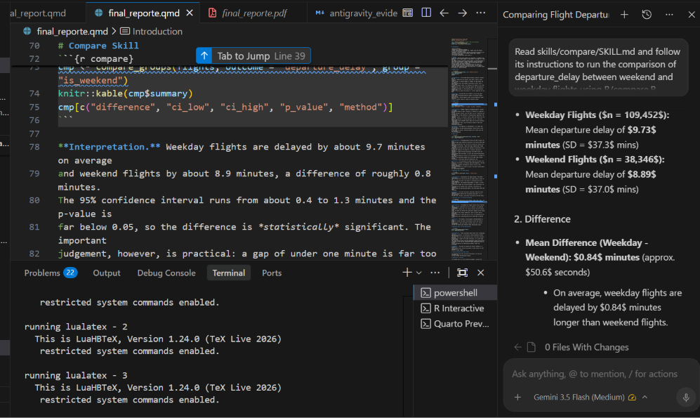
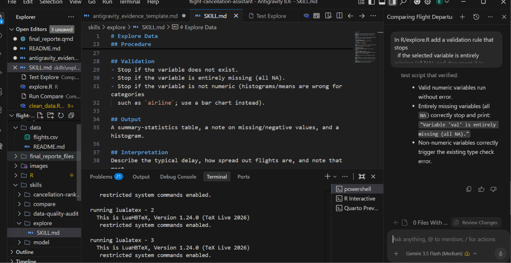
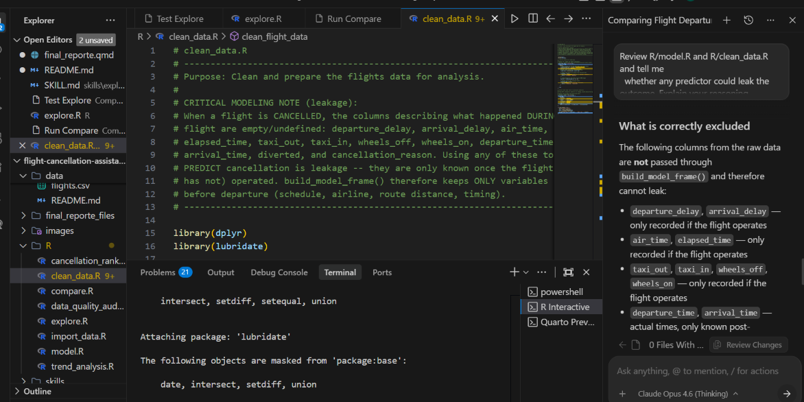

```{r setup}
#| include: false
source("R/import_data.R")
source("R/clean_data.R")
source("R/explore.R")
source("R/compare.R")
source("R/model.R")
source("R/trend_analysis.R")
source("R/cancellation_ranking.R")
source("R/data_quality_audit.R")

raw <- import_flight_data() # samples 150k rows by default
flights <- clean_flight_data(raw)
model_frame <- build_model_frame(flights)
```

# Introduction

Industry (aviation), 
intended user (operations manager), 
problem: cancellations and delays are a common issue that affects airlines and passengers alike.
supported: it allows for better planning and resource allocation, and can help to reduce costs for airlines. project goal:  predict cancellations and delays. 
and selected implementation level (Level 1).

# Dataset
I selected a dataset called flights.csv from kaggle. it wheights over 500mb so i took a random sample in import_data.R. The sample is of 150,000 rows.
The dataset contains information about flights in the United States in 2015. Each row represents a single flight and contains information about the flight, such as the date, time, airline, departure and arrival airports, and delay information. 
missing-/quality-data issues: the missing values are almost all cancelled flights, which have no delay to record, and the negative values are early departures rather than data errors, so neither should be treated as a quality problem.

# Explore Skill

```{r explore}
ex <- explore_variable(flights, var = "departure_delay")
knitr::kable(ex$stats)
ex$quality_note
ex$plot
```

**Interpretation.** The average departure delay is about 9.5 minutes, but the
median is roughly minus two minutes, which means a typical flight actually
leaves a couple of minutes *ahead* of schedule. The gap between the two figures
tells the real story: most flights are punctual or early, while a small number
of severely delayed flights — the maximum in the sample is over 1,100 minutes,
nearly nineteen hours — pull the average upward. The distribution is therefore
strongly right-skewed, as the histogram shows, so for an operations manager the
median is the more honest description of a "normal" departure than the mean.

**Limitation.** This describes one variable on its own and cannot explain *why*
delays occur. The missing values are almost all cancelled flights, which have no
delay to record, and the negative values are early departures rather than data
errors, so neither should be treated as a quality problem.

# Compare Skill

```{r compare}
cmp <- compare_groups(flights, outcome = "departure_delay", group = "is_weekend")
knitr::kable(cmp$summary)
cmp[c("difference", "ci_low", "ci_high", "p_value", "method")]
```

**Interpretation.** Weekday flights are delayed by about 9.7 minutes on average
and weekend flights by about 8.9 minutes, a difference of roughly 0.8 minutes.
The 95% confidence interval runs from about 0.4 to 1.3 minutes and the p-value is
far below 0.05, so the difference is *statistically* significant. The important
judgement, however, is practical: a gap of under one minute is far too small to
matter for scheduling or staffing decisions. This is a clear case where a very
large sample (nearly 148,000 flights) makes even a trivial difference "significant"
in the statistical sense, and it would be a mistake to treat that significance as
operational importance.

**Limitation.** The comparison is observational, so it cannot show that the day
of week *causes* the small delay difference — factors such as route mix or time
of day could be involved. Cancelled flights have no delay value and are excluded
from the comparison.

# Model Skill

```{r model}
fit <- fit_cancellation_model(model_frame, threshold = 0.05)
knitr::kable(fit$metrics)
```

**Interpretation.** The headline metric here is the AUC of about 0.74, which
means the model ranks flights by cancellation risk clearly better than chance.
Accuracy is deliberately *not* the metric to lead with: because only about 1.5%
of flights are cancelled, a model that simply labelled every flight "operated"
would score around 98% accuracy while catching no cancellations at all — which is
exactly what happens at the default 0.5 threshold. Lowering the decision
threshold to roughly the base cancellation rate (0.05) forces the model to
actually flag high-risk flights, so recall and precision above become meaningful:
the model now identifies a share of true cancellations in exchange for some false
alarms. For an operations manager this is the right trade, because missing a
cancellation is more costly than over-preparing for one.

**Limitation.** The associations the model finds are not causal, and its
predictors are limited to information known before departure. The real drivers of
cancellation — weather and mechanical faults — are not in this dataset, which is
why predictive power has a natural ceiling. The results should support planning,
not replace human judgement.

# Additional Skill 1 — Trend Analysis

```{r trend}
tr <- trend_over_time(flights, metric = "cancel_rate")
tr$plot
```

**Interpretation.** Cancellations are highly seasonal. The monthly cancellation
rate sits near 1% for most of the year but spikes sharply to about 5% in
February, then falls back. This pattern is consistent with severe winter weather
early in the year, which grounds large numbers of flights in a short window. For
an operations manager the practical message is that cancellation risk is
predictable at the calendar level: resources, crew buffers, and rebooking
capacity should be pre-positioned ahead of the winter peak rather than added
reactively.

**Limitation.** The chart describes a single year (2015) and cannot separate a
recurring seasonal pattern from one unusually bad winter. It is a description of
the past, not a forecast, and it does not account for one-off events.

# Additional Skill 2 — Cancellation Ranking

```{r ranking}
top_risk <- rank_cancellation_risk(fit$model, model_frame, top_n = 10)
knitr::kable(top_risk[, c("rank", "cancel_probability", "airline", "month", "is_weekend", "distance")])
```

**Interpretation.** The highest-risk flight profiles are all from the same
regional carrier (code MQ) and all fall in February, with predicted cancellation
probabilities around 17-18%. This lines up directly with the seasonal trend
above: the model has learned that a particular regional airline flying in the
winter peak is the riskiest combination, which is exactly what an operations
manager would want to watch and plan for first. The ranking turns the model's
probabilities into a concrete priority list rather than an abstract score.

**Limitation.** The ranking is only as good as the model behind it, whose
predictors exclude the weather and mechanical causes that actually drive
cancellations. A high rank signals elevated *risk*, not a certain cancellation,
and the list should guide attention rather than dictate action.

# Additional Skill 3 — Data Quality Audit

```{r audit}
audit <- audit_data_quality(flights)
knitr::kable(audit$issues)
```

**Interpretation.** Every consistency check returns zero: no duplicate rows, no
non-positive distances, no cancellation reasons attached to flights that were not
cancelled, and no out-of-range departure hours. This gives confidence that the
prepared data is sound for the other five skills. It is worth being explicit that
this clean result follows *from* the preparation step — the structural
missingness in the raw data (cancelled flights legitimately having no delay or
arrival information) was understood and handled, rather than overlooked.

**Limitation.** The audit only detects the specific problems it is written to
check. A clean result confirms the absence of those issues, not that the data is
perfect in every respect.

# Google Antigravity and Agent Skills

### Example 1 — Running an analysis through a skill
- **Request given to Antigravity:** "Read skills/compare/SKILL.md and follow it to
  compare departure_delay between weekend and weekday flights using R/compare.R."
- **Skill used:** compare
- **File(s) involved:** skills/compare/SKILL.md, R/compare.R
- **What I reviewed:** Mean Difference (Weekday - Weekend): 0.84 minutes (approx. 50.6 seconds)
On average, weekday flights are delayed by 0.84 minutes longer than weekend flights
- **What I corrected / accepted / rejected:** Accepted — results matched my rendered report, confirming the skill ran correctly.
- **Evidence:** 

### Example 2 — Improving R code and a skill file
- **Request given to Antigravity:** "In R/explore.R add a validation rule that stops
  if the selected variable is entirely missing (all NA), and document it in
  skills/explore/SKILL.md."
- **Skill used:** explore
- **File(s) changed:** R/explore.R, skills/explore/SKILL.md
- **What I reviewed:** The validation rule works and it ran without errors.
- **What I corrected / accepted / rejected:** I accepted the changes.
- **Evidence:** 

### Example 3 — Reviewing for statistical soundness (leakage)
- **Request given to Antigravity:** "Review R/model.R and R/clean_data.R and tell me
  whether any predictor could leak the outcome. Explain your reasoning."
- **Skill used:** model
- **File(s) involved:** R/model.R, R/clean_data.R
- **What I reviewed:** the agent correctly identified that delay, air_time, arrival and cancellation reason are only known after the flight, therefore they are excluded from build_model_frame().
- **What I corrected / accepted / rejected:** Accepted the agent's reasoning because it matched my own understanding of why those columns are leakage as i explained above and in the CRITICAL MODELING NOTE in R/clean_data.R
- **Evidence:** 

### How I verified the statistical results

i checked the results by running the R scripts directly and comparing them to the rendered report.

# Application or Delivery

The intended user — an airline operations manager — accesses the assistant through
this reproducible Quarto report (Level 1). Each skill is defined by a SKILL.md
file that tells the agent which inputs are required, what to validate, which R
function to run, and how to explain the result.

# Validation Examples

```{r validation, error=TRUE}
# Wrong variable type for a histogram
explore_variable(flights, var = "airline")
```

# Limitations

**Dataset limitation.** The data covers a single year of US domestic flights and
omits the main causes of cancellation (weather and mechanical faults), which caps
how well any model built on it can perform.

**Statistical limitation.** All results are associational, not causal, and the outcome is highly imbalanced, so metrics must be read with care — accuracy in particular is misleading and was replaced by AUC and recall.

**Implementation limitation.** The assistant is a decision-support report, not an automated system; it informs a manager's judgement but does not act on its own, and it reflects a static sample rather than live data.

# Reflection

What you learned, what was most difficult, 
skills: trend analysis: to show that cancellations are seasonal, cancellation ranking: to show which flights are at highest risk of cancellation, data quality audit: to show that the data is clean and reliable
 I would like to see if i can implement machine learning models like random forest and adaboost to predict cancellations.

